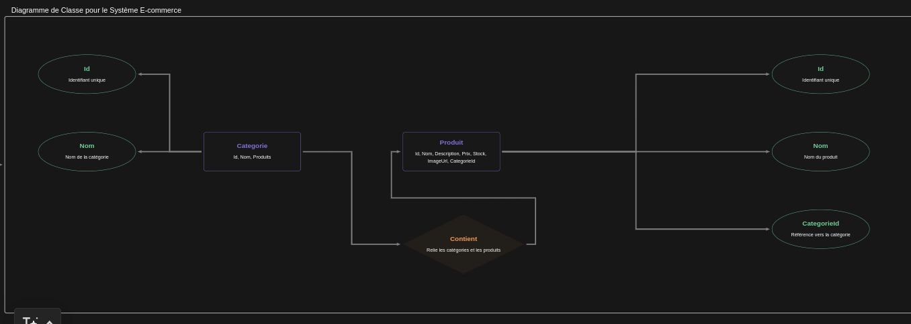
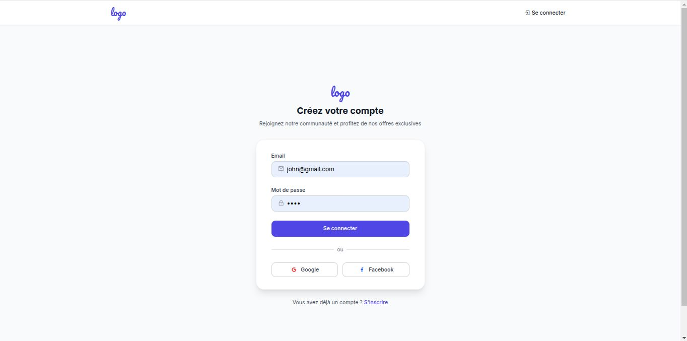
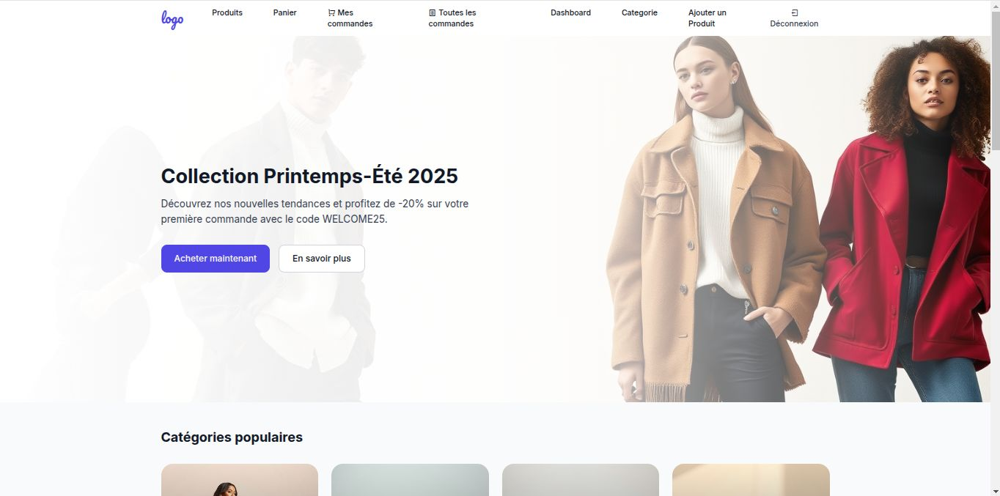
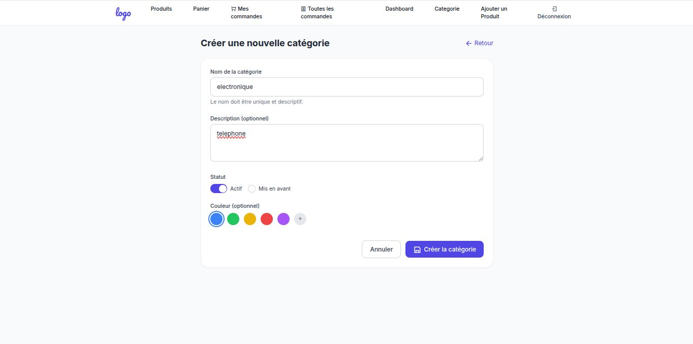
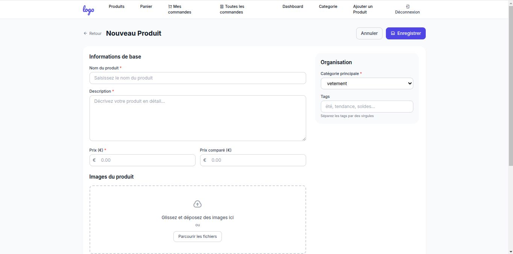
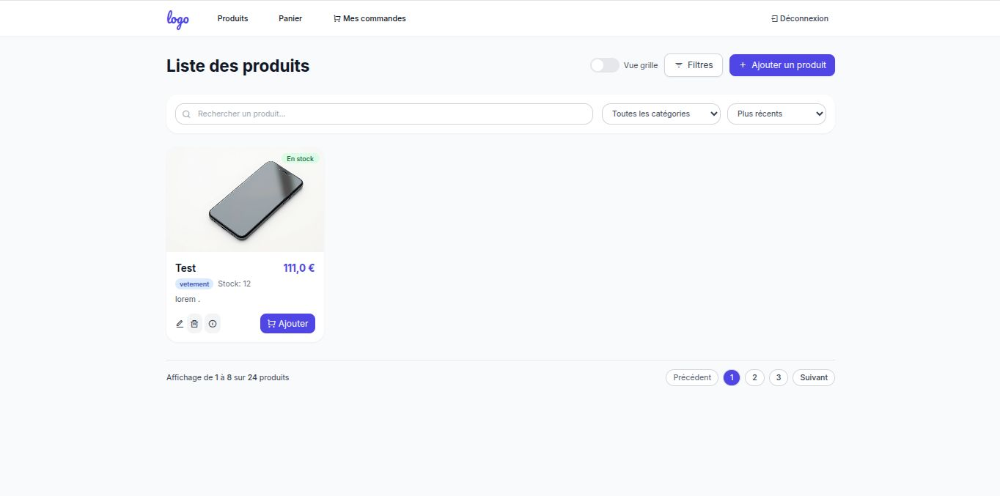
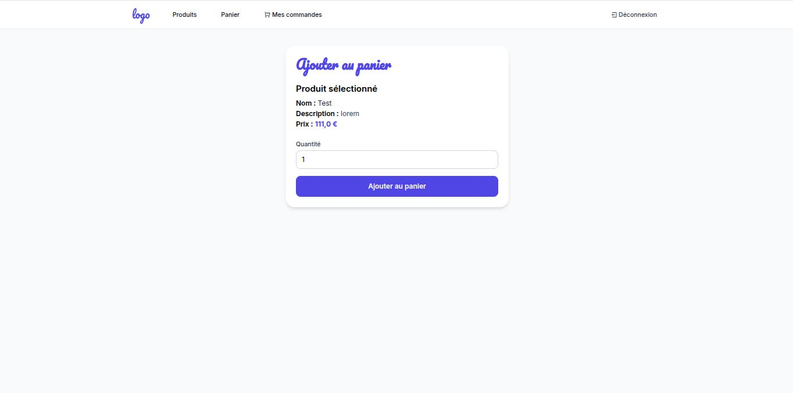
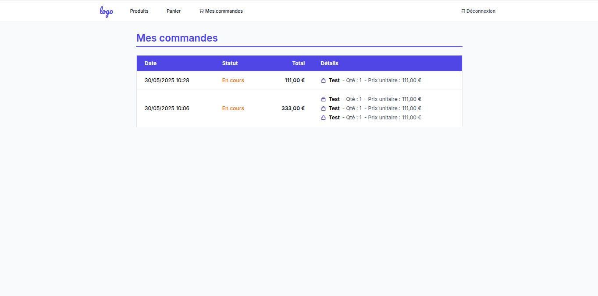

# 🛒 Projet E-commerce - ASP.NET MVC

Ce projet est une application e-commerce développée avec **ASP.NET MVC**. Il permet à des clients de parcourir des produits, les ajouter au panier et passer des commandes. Les administrateurs peuvent gérer les produits, les commandes et les utilisateurs.

---

## 🚀 Fonctionnalités

### 👤 Côté Client
- S’inscrire et se connecter
- Parcourir les produits
- Ajouter des produits au panier
- Passer une commande
- Voir l’historique des commandes

### 🛠️ Côté Admin
- Ajouter, modifier et supprimer des produits
- Gérer les commandes
- Gérer les utilisateurs

---

## 🧩 Diagramme de classe



---

## 🖼️ Captures d’écran

### 🔐 Page de connexion


### 🎛️ Interface Admin

- Capture 1 
  

- Capture 2
  

- Capture 3
  

### 🛍️ Interface Client

- Capture 1
  

- Capture 2
  

- Capture 3
  

- Capture 4
  

---

## ⚙️ Technologies utilisées

- ASP.NET MVC
- Entity Framework
- SQL Server
- Bootstrap

---

## 📁 Structure de base du projet

```bash
ecommerce/
├── Controllers/
├── Models/
│   └── Domain/
│   └── ViewModels/
├── Views/
├── wwwroot/
├── demo/
│   ├── *.jpg (captures d'écran)
│   └── diagramme.jpg
├── appsettings.json
├── Program.cs
└── Startup.cs
